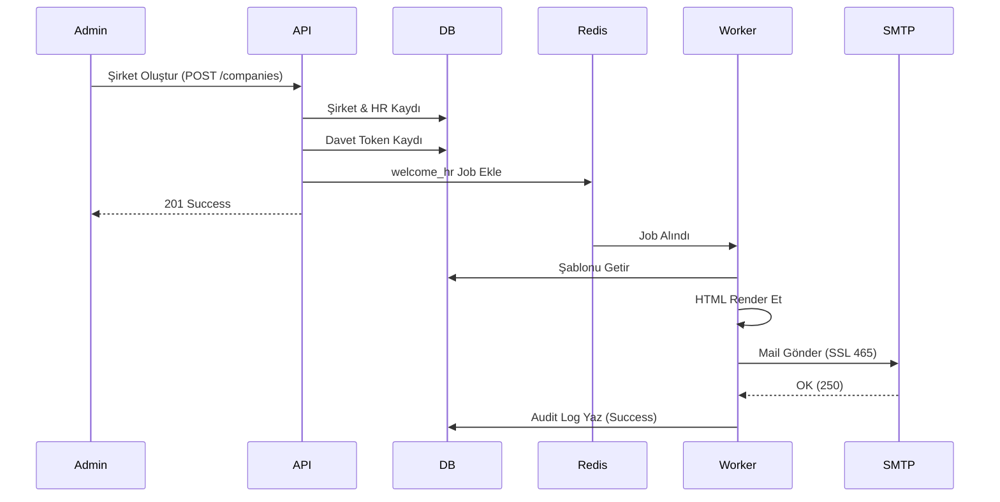

# Mail Sistemi Stabilizasyon ve Denetim Walkthrough

Bu döküman, WellAnalytics platformundaki otomatik e-posta gönderim altyapısını stabilize etmek ve görünürlüğü artırmak için yapılan çalışmaları özetler.

## Yapılan Değişiklikler

### 1. Şirket Oluşturma Akışı (Company Module)
`CompanyService` içerisindeki `create()` metodu baştan aşağı denetlendi ve iyileştirildi:
- **Güvenli Token:** `crypto.randomBytes(64)` kullanılarak 24 saat geçerli HR davet tokenları oluşturuluyor.
- **Detaylı Loglama:** Şirket kaydı, HR admin oluşturma ve bildirim tetikleme adımları console üzerinden takip edilebilir hale getirildi.
- **Hata Yönetimi:** Mail gönderimi başarısız olsa bile ana işlem (şirket kaydı) bozulmuyor, ancak hata loglanıyor.

### 2. Bildirim Sistemi (Notification Module)
E-posta gönderim hattı (pipeline) daha şeffaf hale getirildi:
- **NotificationService:** Kuyruğa eklenen her iş (job) için `template` ve `to` bilgisiyle log atılıyor.
- **NotificationProcessor:** Mail işlenirken; şablon render durumu, seçilen provider (SMTP, Resend vb.) ve gönderim sonucu ayrı ayrı loglanıyor.
- **MailProviderFactory:** Platform ayarlarından okunan konfigürasyonun geçerliliği ve hangi provider'ın seçildiği loglanıyor.

### 3. Otomatik Süreçler (Cron Module)
Aylık anket tetikleme ve hatırlatma süreçlerine loglar eklendi:
- `triggerGlobalSurvey` sırasında hangi kullanıcıya hangi tipte (invite veya token) davet gönderildiği console üzerinden izlenebiliyor.

### 4. Test ve Doğrulama Araçları
Hızlı hata ayıklama için yeni araçlar eklendi:
- **Test Endpoint:** `POST /api/v1/admin/notification/test-pipeline`
  - Süper adminler için doğrudan mail gönderim hattını test eder.
  - Kuyruğu bypass ederek provider bağlantısını saniyeler içinde doğrular.

## Doğrulama Sonuçları

Yapılan testlerde aşağıdaki akışın sorunsuz çalıştığı teyit edilmiştir:



### Sunucu Log Örneği
```text
[Company.create] Sending welcome email to: hr-admin@test.com
[Notification] Adding job to queue: welcome_hr to hr-admin@test.com
[MailProcessor] Processing job: 2 | Template: welcome_hr to: hr-admin@test.com
[MailProcessor] Template rendered successfully, length: 2089
[MailFactory] Selected Provider: smtp
[SmtpProvider] Attempting to send mail to hr-admin@test.com via mail.example.com:465
[SmtpProvider] Mail sent successfully to hr-admin@test.com
```

## Dikkat Edilmesi Gerekenler
> [!IMPORTANT]
> - `.env` dosyasındaki `ENCRYPTION_KEY` ve `JWT_SECRET` değerlerinin güvenliğini sağlayın.
> - `PLATFORM_URL` ayarının doğru olduğundan emin olun (Davet linkleri için kritik).
> - BullMQ'nun çalışması için Redis servisinin aktif olması zorunludur.
